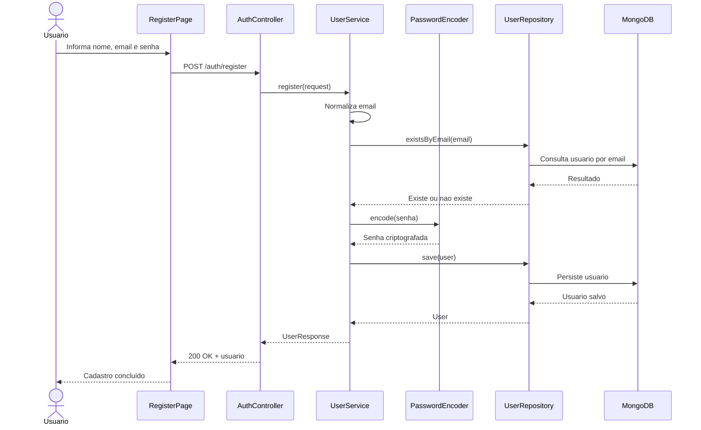
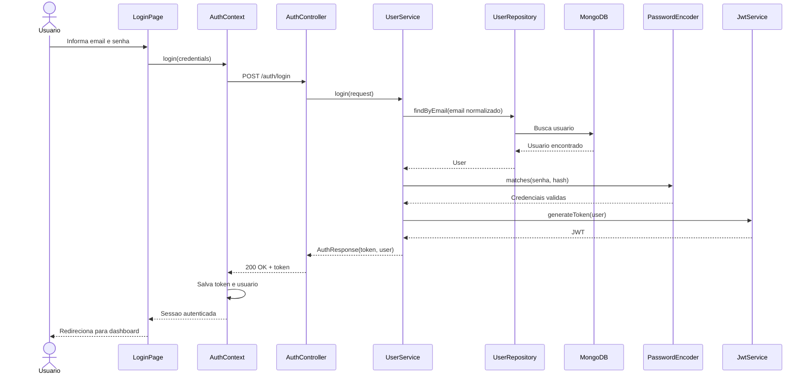
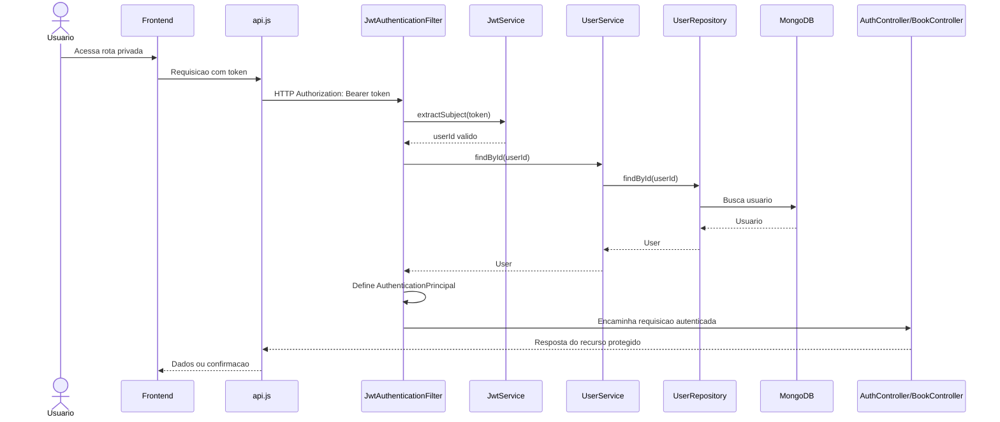
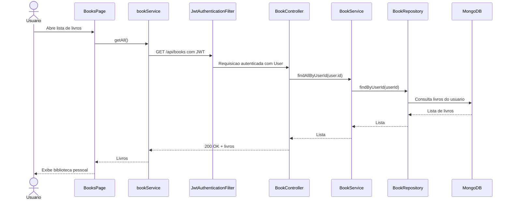
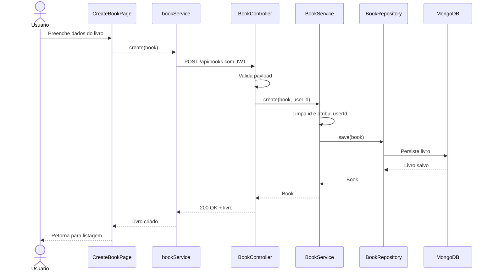
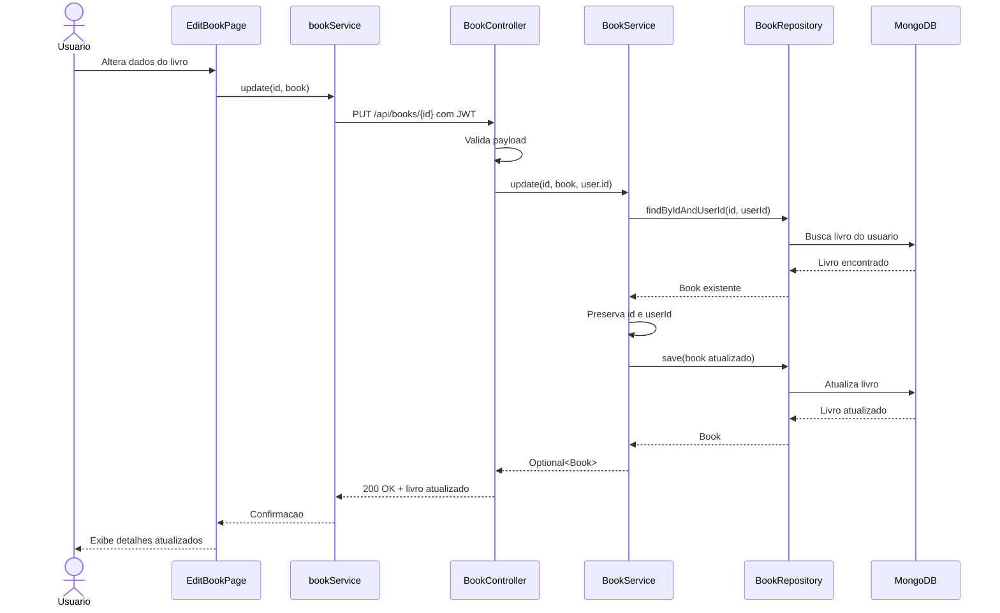
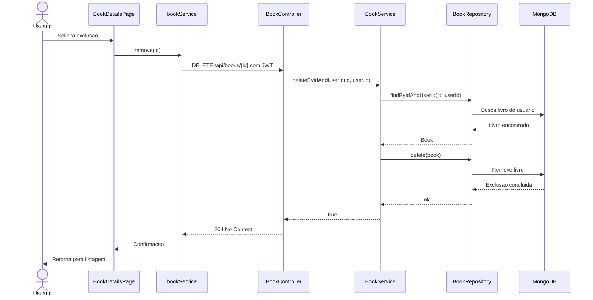
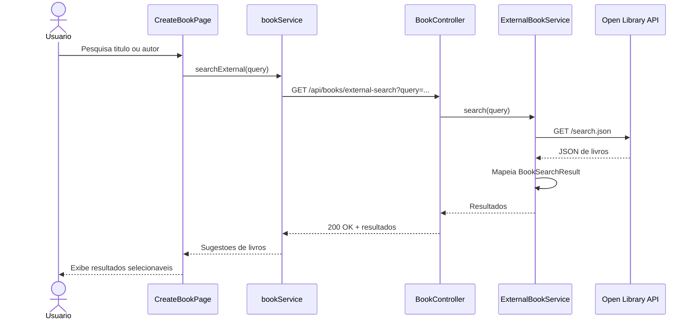

# RTM - Matriz de Rastreabilidade

Projeto: Gerenciador de Biblioteca Pessoal  
Data de referência: 2026-05-13

Este documento rastreia os requisitos funcionais, técnicos, de qualidade e de documentação até os artefatos de implementação e testes existentes no repositório.

Legenda de status:

- Atendido: requisito implementado e com evidência rastreável.
- Parcial: requisito implementado parcialmente ou sem evidência completa.
- Pendente: requisito ainda não evidenciado no repositório.

## Matriz de Requisitos Funcionais

| ID | Requisito | Implementação | Evidência/Testes | Status |
| --- | --- | --- | --- | --- |
| RF-01 | Permitir cadastro de novos usuários. | `AuthController.register`, `UserService.register`, `UserRepository`, `RegisterPage`, `authService.register`. | `AuthControllerTest.registerPersistsAndReturnsCreatedUser`, `ValidationExceptionHandlerTest.registerReturnsBadRequestForInvalidPayload`, `UserServiceTest`. | Atendido |
| RF-02 | Permitir login com email e senha. | `AuthController.login`, `UserService.login`, `JwtService`, `LoginPage`, `AuthContext.login`. | `AuthControllerTest.loginReturnsAuthResponseForPersistedUser`, `UserServiceTest.loginReturnsTokenForValidCredentials`. | Atendido |
| RF-03 | Manter sessão autenticada por JWT. | `JwtService`, `JwtAuthenticationFilter`, `SecurityConfig`, `AuthContext`, `ProtectedRoute`, interceptor Axios em `api.js`. | `AuthControllerTest.meReturnsAuthenticatedUserFromJwt`, `JwtServiceTest`, `JwtAuthenticationFilterTest`. | Atendido |
| RF-04 | Consultar dados do usuário autenticado. | `AuthController.me`, `UserResponse`, `AuthContext.getMe`. | `AuthControllerTest.meReturnsAuthenticatedUserFromJwt`. | Atendido |
| RF-05 | Encerrar sessão do usuário. | `AuthController.logout`, `AuthContext.logout`, `Sidebar`. | `AuthControllerTest.logoutReturnsSuccessMessageForAuthenticatedUser`. | Atendido |
| RF-06 | Listar livros da biblioteca do usuário autenticado. | `BookController.getAllBooks`, `BookService.findAllByUserId`, `BookRepository.findByUserId`, `BooksPage`, `bookService.getAll`. | `BookControllerTest.getAllBooksReturnsOnlyAuthenticatedUserBooks`, `BookServiceIntegrationTest.findAndUpdateAreScopedByUserId`. | Atendido |
| RF-07 | Buscar livro por ID respeitando o usuário autenticado. | `BookController.getBookById`, `BookService.findByIdAndUserId`, `BookRepository.findByIdAndUserId`, `BookDetailsPage`. | `BookControllerTest.getBookByIdReturnsBookOnlyForOwner`. | Atendido |
| RF-08 | Buscar livros por autor respeitando o usuário autenticado. | `BookController.searchByAuthor`, `BookService.findByAuthorAndUserId`, `BookRepository.findByAutorContainingIgnoreCaseAndUserId`. | `BookControllerTest.searchByAuthorReturnsOnlyAuthenticatedUserBooks`. | Atendido |
| RF-09 | Cadastrar livros na biblioteca pessoal. | `BookController.createBook`, `BookService.create`, `BookRepository`, `CreateBookPage`, `bookService.create`. | `BookControllerTest.createBookPersistsBookForAuthenticatedUser`, `BookServiceIntegrationTest.createPersistsBookForUserInMongo`, `ValidationExceptionHandlerTest.createBookReturnsBadRequestForInvalidPayload`. | Atendido |
| RF-10 | Editar livros existentes da biblioteca pessoal. | `BookController.updateBook`, `BookService.update`, `EditBookPage`, `bookService.update`. | `BookControllerTest.updateBookChangesOnlyOwnerBook`, `BookServiceIntegrationTest.findAndUpdateAreScopedByUserId`, `BookServiceIntegrationTest.updateDoesNotChangeBookFromAnotherUser`. | Atendido |
| RF-11 | Excluir livros existentes da biblioteca pessoal. | `BookController.deleteBook`, `BookService.deleteByIdAndUserId`, `BookDetailsPage`, `bookService.remove`. | `BookControllerTest.deleteBookRemovesOnlyOwnerBook`, `BookServiceIntegrationTest.deleteDoesNotRemoveBookFromAnotherUser`. | Atendido |
| RF-12 | Isolar os dados de livros por usuário autenticado. | `Book.userId`, consultas por `userId`, `@AuthenticationPrincipal` nos endpoints de livros. | `BookControllerTest` cobre listagem, busca, atualização e exclusão por usuário; `BookServiceIntegrationTest` cobre escopo por `userId`. | Atendido |
| RF-13 | Pesquisar livros na API externa Open Library. | `BookController.searchExternalBooks`, `ExternalBookService.search`, `CreateBookPage.handleSearch`. | `ExternalBookServiceVcrTest.searchMapsRecordedOpenLibraryResponse` com Hoverfly. | Atendido |
| RF-14 | Exibir dashboard e navegação das áreas autenticadas. | `DashboardPage`, `MainLayout`, `Navbar`, `Sidebar`, `AppRoutes`. | Evidência por implementação frontend; não há teste automatizado frontend no repositório. | Parcial |
| RF-15 | Bloquear acesso às telas privadas para usuários não autenticados. | `ProtectedRoute`, `AuthContext`, interceptor em `api.js`. | Evidência por implementação frontend; não há teste automatizado frontend no repositório. | Parcial |

## Matriz de Requisitos Técnicos

| ID | Requisito | Implementação | Evidência/Testes | Status |
| --- | --- | --- | --- | --- |
| RT-01 | Backend em Spring Boot com Java 17. | `backend/pom.xml`, `BibliotecaPessoalApplication`. | `BibliotecaPessoalApplicationTests.contextLoads`. | Atendido |
| RT-02 | Persistência NoSQL com MongoDB. | `spring-boot-starter-data-mongodb`, `application.properties`, `BookRepository`, `UserRepository`. | `BookServiceIntegrationTest`, `AuthControllerTest`, `BookControllerTest` via Testcontainers. | Atendido |
| RT-03 | Arquitetura MVC com separação de camadas. | Pacotes `controller`, `service`, `repository`, `model`, `dto`, `exception`, `security`. | Evidência estrutural do código. | Atendido |
| RT-04 | Segurança stateless com JWT. | `JwtService`, `JwtAuthenticationFilter`, `SecurityConfig`. | `JwtServiceTest`, `JwtAuthenticationFilterTest`, `AuthControllerTest`. | Atendido |
| RT-05 | Validação de entrada com mensagens de erro padronizadas. | Jakarta Validation em DTOs/modelos e `ApiExceptionHandler`. | `ValidationExceptionHandlerTest`. | Atendido |
| RT-06 | Integração externa reprodutível com VCR. | `ExternalBookService`, Hoverfly, `hoverfly/open-library-search.json`. | `ExternalBookServiceVcrTest`. | Atendido |
| RT-07 | Testes de integração usando Testcontainers MongoDB. | `AbstractMongoIntegrationTest`, dependências Testcontainers no `pom.xml`. | `BookServiceIntegrationTest`, `AuthControllerTest`, `BookControllerTest`, `BibliotecaPessoalApplicationTests`. | Atendido |
| RT-08 | Frontend React/Vite funcional. | `frontend/package.json`, `App.jsx`, `AppRoutes`, páginas em `frontend/src/pages`. | Evidência por implementação e build esperado; não há teste frontend automatizado registrado. | Parcial |
| RT-09 | Gerenciamento de sessão no frontend. | `AuthContext`, `useAuth`, `authService`, `api.js`, `ProtectedRoute`. | Evidência por implementação frontend. | Parcial |
| RT-10 | Design responsivo. | Componentes e páginas com classes responsivas Tailwind. | Evidência por implementação frontend; sem teste visual automatizado. | Parcial |
| RT-11 | CI com GitHub Actions. | `.github/workflows/backend-ci.yml`. | Evidência por workflow versionado. | Atendido |
| RT-12 | Análise SonarQube/SonarCloud. | Configuração Sonar no `pom.xml` e workflow. | Evidência por configuração versionada. | Atendido |

## Matriz de Qualidade e Testes

| ID | Requisito | Implementação | Evidência/Testes | Status |
| --- | --- | --- | --- | --- |
| RQ-01 | Cobertura mínima de 80%. | `jacoco-maven-plugin` com regra `check` vinculada ao phase `verify` no `backend/pom.xml`; CI executa `mvn -B verify`. | `mvn verify` executa testes, gera `target/site/jacoco` e falha se a cobertura de instruções ficar abaixo de 80%. | Atendido |
| RQ-02 | Testes de caixa preta/controller sem mocks para fluxos HTTP. | `AuthControllerTest` e `BookControllerTest` com `@SpringBootTest` herdado de `AbstractMongoIntegrationTest` e `MockMvc`. | Testes exercitam endpoints reais e MongoDB via Testcontainers. | Atendido |
| RQ-03 | Testes com Testcontainers. | `AbstractMongoIntegrationTest` inicia `MongoDBContainer`. | Classes de integração herdam a base Mongo. | Atendido |
| RQ-04 | Testes com VCR. | Hoverfly configurado no teste da Open Library. | `ExternalBookServiceVcrTest`. | Atendido |
| RQ-05 | Testes parametrizados. | `ValidationExceptionHandlerTest` com `@ParameterizedTest`. | Cenários inválidos de cadastro, livro e status. | Atendido |
| RQ-06 | Testes de caixa branca para regras internas. | Serviços e segurança testados diretamente. | `UserServiceTest`, `JwtServiceTest`, `JwtAuthenticationFilterTest`, `ModelAndDtoTest`. | Atendido |
| RQ-07 | Eliminar bibliotecas de simulação do projeto final. | Testes de controller, serviço, validação e segurança usam objetos reais, Testcontainers ou implementações manuais simples; o frontend não mantém mais modo preview com dados falsos. | Busca por padrões de simulação nos fontes não encontra chamadas ou anotações desse tipo. | Atendido |
| RQ-08 | Testes frontend. | Frontend configurado com Vitest, jsdom e Testing Library, com scripts `test` e `test:watch`. | `Button.test.jsx`, `Modal.test.jsx`, `ReadingStatusBadge.test.jsx`, `ProtectedRoute.test.jsx` e `LoginPage.test.jsx`; `npm run test` com 9 testes aprovados. | Atendido |

## Matriz de Documentação e Entrega

| ID | Requisito | Implementação | Evidência | Status |
| --- | --- | --- | --- | --- |
| RD-01 | README com visão geral e execução. | `README.md`. | Documento versionado na raiz. | Parcial |
| RD-02 | RTM com matriz de rastreabilidade. | `RTM.md`. | Este documento. | Atendido |
| RD-03 | Diagramas UML de sequência no RTM. | Diagramas Mermaid nas seções abaixo. | Este documento. | Atendido |
| RD-04 | Relatório de cobertura. | JaCoCo configurado para gerar relatório e validar cobertura no phase `verify`. | `backend/pom.xml`; artefatos gerados em `backend/target/site/jacoco`; workflow executa `mvn -B verify`. | Atendido |
| RD-05 | Repositório versionado no GitHub. | Histórico Git e workflow. | Evidência pelo próprio repositório. | Atendido |

## Diagramas de Sequência UML

### Cadastro de Usuário

### Login e Geração de JWT

### Acesso a Recurso Protegido

### Listar Livros do Usuário

### Criar Livro

### Editar Livro

### Excluir Livro

### Busca Externa na Open Library

## Lacunas Rastreáveis

| ID | Lacuna | Impacto | Próxima ação sugerida |
| --- | --- | --- | --- |
| GAP-01 | Removida. A regra de ausência de mocks foi atendida nos testes e no frontend. | Sem impacto pendente. | Manter novas contribuições sem bibliotecas de mock ou dados falsos de preview. |
| GAP-02 | Removida. Há testes automatizados frontend. | Sem impacto pendente. | Expandir cobertura gradualmente para CRUD completo e fluxos E2E quando houver ambiente de execução dedicado. |
| GAP-03 | README ainda está parcial frente ao escopo completo. | Dificulta reprodução da entrega por avaliadores. | Atualizar README com backend, frontend, variáveis, Docker/Testcontainers, testes, cobertura e CI. |
